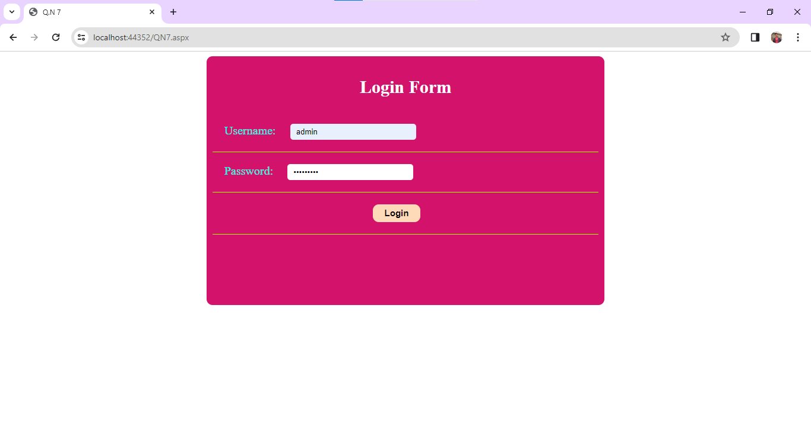
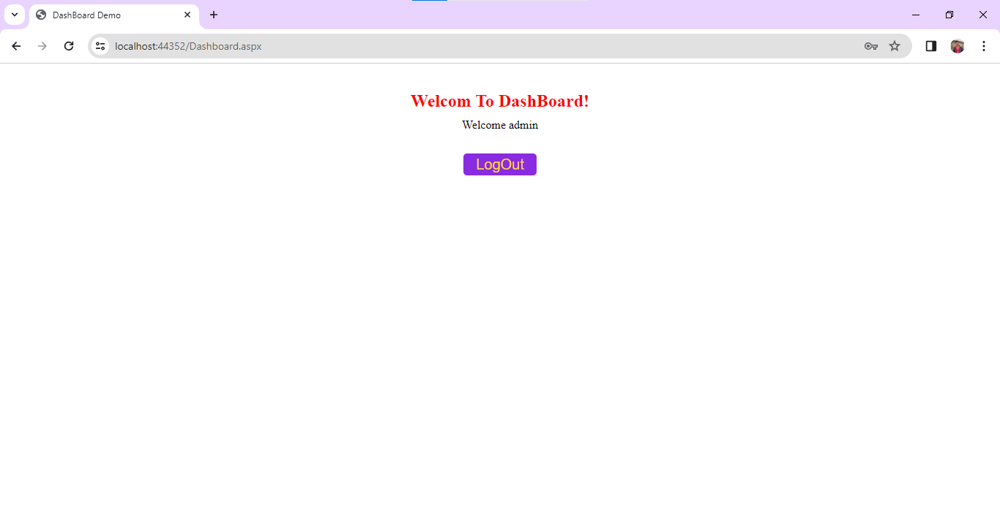

# Session Management Server-Side Script

This repository contains the server-side script for managing session data. It enables storing, retrieving, and destroying session data.

## Getting Started

To get started with this program, follow these steps:

1. Clone this repository to your local machine.
2. Ensure you have the necessary dependencies installed.
3. Run the server-side program.
4. Access the calculator form through the provided URL.
5. Input values in the designated field and press the appropriate button to calculate the result.

## Dependencies

Make sure you have the following dependencies installed:

- [ASP.NET](https://dotnet.microsoft.com/apps/aspnet) - Web framework for building modern web apps and services with .NET
- [C#](https://docs.microsoft.com/en-us/dotnet/csharp/) - Modern, general-purpose programming language
- [HTML](https://developer.mozilla.org/en-US/docs/Web/HTML) - Standard markup language for creating web pages
- [CSS](https://developer.mozilla.org/en-US/docs/Web/CSS) - Style sheet language used for describing the presentation of a document written in HTML
- [MySQL Database Management System](https://www.mysql.com/) - Open-source relational database management system.

## Session Management

The server-side script provides the following functionalities for session management:

1. **Storing Session Data**: Allows storing user-specific data in the session.
2. **Retrieving Session Data**: Enables retrieving previously stored session data for authenticated users.
3. **Destroying Session Data**: Allows destroying the session data, typically used during user logout or session expiry.

## Contributing

If you'd like to contribute to this project, please follow these guidelines:

1. Fork the repository.
2. Create your feature branch (`git checkout -b QN7/QN7`).
3. Commit your changes (`git commit -am 'Add some feature'`).
4. Push to the branch (`git push origin QN7/QN7`).
5. Create a new Pull Request.

## License

This project is licensed under the [MIT License](MIT-LICENSE). This means the project is free for anyone to clone or use for their own projects.
